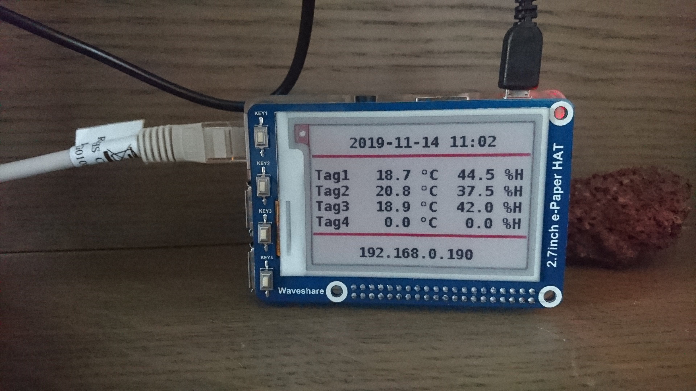

# RuuviTag ePaper

This program receives temperature and humidity measurements from RuuviTag sensors using MQTT and shows them on a Waveshare 2.7 inch three-colour e-Paper HAT.

This project is not affiliated to the [Ruuvi](https://ruuvi.com) company in any way.

## Picture

This is a picture of the setup of this project:



## System requirements

This program has been tested on a Raspberry Pi 3B with Raspbian Buster Lite, with a [Waveshare 2.7 inch three-colour e-Paper HAT](https://www.waveshare.com/wiki/2.7inch_e-Paper_HAT_(B)).

Enable SPI:

```shell
sudo raspi-config
```

Choose **5 Interfacing Options**, then **P4 SPI** and **Yes** to enable the SPI interface. Afterwards, reboot to apply the change.

## Configuration

This is just an example, meant to be used in the [Ruuvitag Demo](https://github.com/koenvervloesem/ruuvitag-demo) project. You can use this in your own configuration by changing the constants in the beginning of the code.

## Docker installation

The easiest way to install this program is by using Docker. So first install Docker:

```shel
curl -sSL https://get.docker.com | sh
```

And give the `pi` user access to Docker by adding it to the `docker` group:

```shell
sudo usermod pi -aG docker
```

Log out and then log in again, so the group permissions are applied to your session.

## Building the Docker image

Clone the repository (you may have to `sudo apt install git` first) and enter the directory:

```shell
git clone https://github.com/koenvervloesem/ruuvitag-epaper.git
cd ruuvitag-epaper
```

Then build the Docker image:

```shell
docker build . -t ruuvitag-epaper
```

After the image has been built successfully, you can use it with the RuuviTag Demo using the alternative Docker Compose file:

```shell
cd ~/ruuvitag-demo
docker-compose -f docker-compose-epaper.yml up -d
```

After a minute or so, the display should start showing sensor measurements for the four RuuviTags configured in the RuuviTag Demo project.

## Stopping the demo

If you want to stop the demo, just run:

```shell
docker-compose -f docker-compose-epaper.yml down
```

## About the Waveshare e-Paper HAT

The display code is based on the project [epaper-clock-and-more](https://github.com/pskowronek/epaper-clock-and-more), which has optimized the original code from Waveshare to get a better refresh rate. Still, every refresh is clearly visible as a flickering of the whole screen. This is even worse for the red components. If someone knows a solution to this, please let me know!

If you want to use another model of the e-Paper HAT, you'll have to use another file than `epd2in7b_fast_lut.py` and make some changes in the code.

## License

This program is provided by [Koen Vervloesem](mailto:koen@vervloesem.eu) as open source software with the MIT license. See the LICENSE file for more information.
